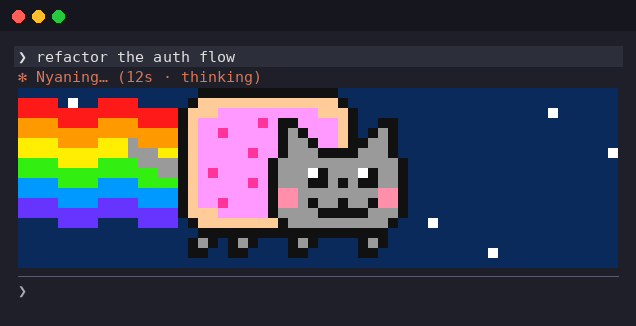
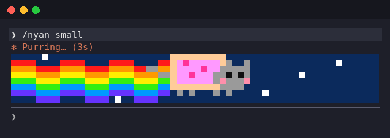

# claude-nyan-cat

Nyan Cat for Claude Code: while Claude is working, a pixel-art Nyan Cat flies with its rainbow above the prompt.



## Install

In Claude Code:

```
/plugin marketplace add besanek/claude-nyan-cat
/plugin install nyan-cat@claude-nyan-cat
```

Needs Claude Code 2.1.289 or newer (plugins with function hooks are early access).

### Updates

Third-party marketplaces don't auto-update by default. To get new versions automatically, open `/plugin` → **Marketplaces** → `claude-nyan-cat` and turn on **auto-update**. Otherwise update by hand:

```
claude plugin update nyan-cat@claude-nyan-cat
```

Then run `/reload-plugins` or start a new session.

## Usage

| Command | What it does |
| --- | --- |
| `/nyan big` | big cat, 9 terminal rows (default) |
| `/nyan small` | small cat, 4 rows |
| `/nyan off` | turns the cat off |
| `/nyan on` | turns it back on at the last size |
| `/nyan` | toggles on/off |

The setting is kept across sessions. The band opens a row at a time, the cat flies in from the left when Claude starts and off to the right when it finishes, then the band closes again, so the transcript never jumps.

`/nyan small` takes less room:



The animation is drawn in the terminal with half-block characters (2 pixels per row), in true color. The desktop app and VS Code show a single line of text instead.

## Development

```
claude --plugin-dir ./plugins/nyan-cat   # run Claude Code with the mod loaded from disk
claude plugin validate ./plugins/nyan-cat
claude plugin test ./plugins/nyan-cat
```

## Credits

Nyan Cat was created by Chris Torres ([nyan.cat](https://www.nyan.cat/)). This is an unofficial fan mod, not affiliated with him or with Anthropic.

## License

MIT
